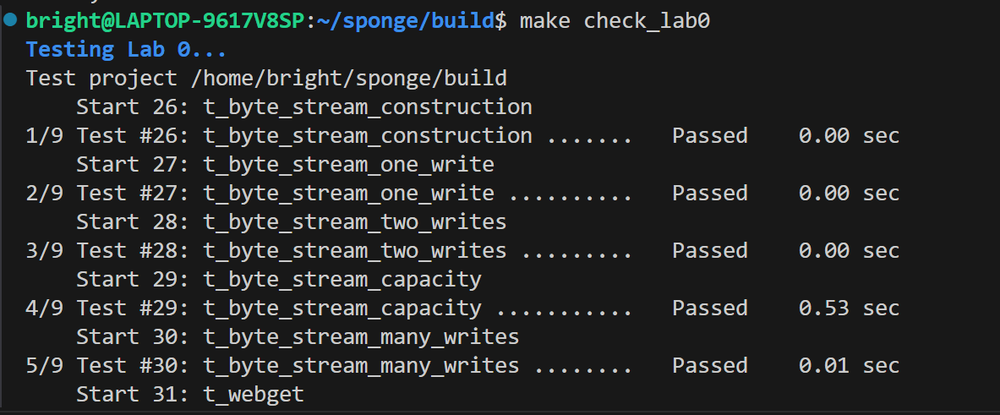

Lab 0 Writeup
=============

My name: [your name here]

My SUNet ID: [your sunetid here]

I collaborated with: [list sunetids here]

This lab took me about [n] hours to do. I [did/did not] attend the lab session.

My secret code from section 2.1 was: [code here]

- Optional: I had unexpected difficulty with: [describe]

- Optional: I think you could make this lab better by: [describe]

- Optional: I was surprised by: [describe]

- Optional: I'm not sure about: [describe]

## 实验结果
### webget

### Byte Stream

### 踩过的坑
测试webget时，第31个用例总是过不了，导致字节流也过不了

最后找到原因，是因为我没有注意到http请求头需要以一个空行来做结尾，所以正确的形式应该是`sock.write("Host: " + host + "\r\n\r\n");`，而不是`sock.write("Host: " + host + "\r\n");`。改过之后，问题解决。